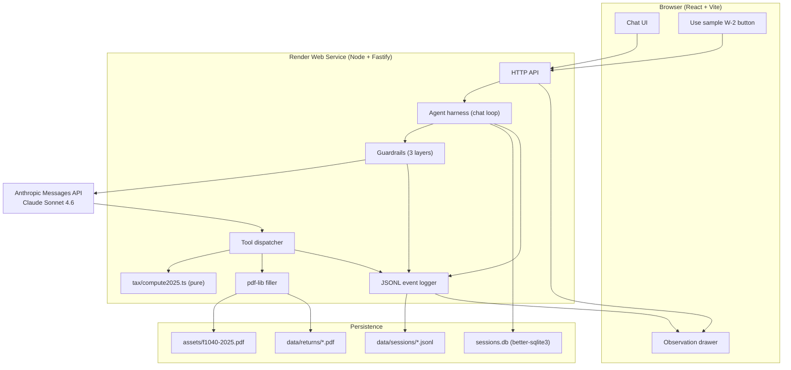
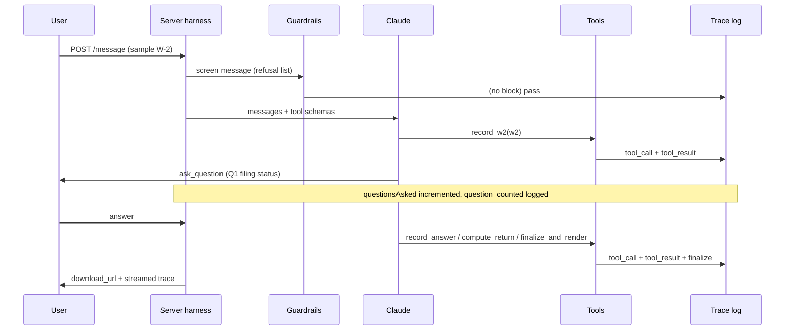

# Architecture (tax-filing-agent)

An agentic chat assistant that helps a W-2 earner (around $40,000/year) file a 2025 Form 1040 and download the filled return. Four enforced pillars: a stateful chat loop, real tools the agent invokes, guardrails enforced in code, and an observation trail the judge can read.

## Topology

## End-to-end data flow (primary use case)

1. User opens the live URL. The React shell loads and calls `POST /api/session`, which creates a session row in `sessions.db` and returns a session id plus a warm assistant greeting.
2. User clicks "Use sample W-2" (or pastes one). The W-2 JSON arrives as a structured user message. The harness forwards it to Claude with the tool schemas attached.
3. Claude calls the `record_w2` tool. The dispatcher validates the W-2 with Zod (Layer A guardrail), persists it on the session, and logs a `tool_call` plus `tool_result` event.
4. The agent asks at most five questions, each as an `ask_question` tool call. A per-session `questionsAsked` counter (Layer C guardrail) is incremented in code; an attempted sixth distinct question is rewritten to a wrap-up by the harness.
5. Each answer comes back through `record_answer`, validated and persisted, logged to the trace.
6. The agent calls `compute_return`, which runs the pure `tax/compute2025.ts` against the W-2 plus answers using the verified 2025 brackets and standard deduction, returning a `Return1040` (refund or balance due).
7. The agent calls `finalize_and_render`, which fills the real IRS `assets/f1040-2025.pdf` AcroForm with `pdf-lib`, flattens it, writes `data/returns/<session>.pdf`, and returns a download URL plus the map of fields filled.
8. The UI shows a download button hitting `GET /api/return/:id/download` (Content-Disposition attachment). The observation drawer streams the full trace from `GET /api/session/:id/trace`.
9. Every user message is screened against `guardrails/refusals.ts` (Layer B) before reaching Claude; a match returns a friendly redirect and logs a `guardrail_block` event.

## Components

| Component | Responsibility | Inputs | Outputs | Persistence | Failure mode |
|-----------|----------------|--------|---------|-------------|--------------|
| HTTP API (Fastify) | Route requests, serve the built React bundle | HTTP | JSON, PDF stream, static files | none | 4xx/5xx with structured body |
| Agent harness | Run the chat loop, carry state across turns, drive the tool loop | message history, tool results | assistant turns | sessions.db | surfaces API errors to the user warmly |
| Guardrails | Validate inputs (A), screen scope/safety (B), enforce 5-question budget (C) | tool args, user text, turn | pass or structured rejection | counter in session | rejects out-of-domain before any tool runs |
| Tool dispatcher | Validate args with Zod, run the matching tool, return structured results | tool name + args | tool result or `{ ok:false, error, remediation }` | via tools | never throws raw to the model |
| tax/compute2025.ts | Pure 2025 tax computation | W-2 + answers | Return1040 | none | deterministic; tested at boundaries |
| pdf-lib filler | Fill and flatten the IRS 1040 AcroForm | Return1040 | flattened PDF | data/returns | missing field name logged, not silently dropped |
| JSONL logger | Append-only observation trail | events | JSONL + stdout | data/sessions | n/a |
| SQLite store | Persist sessions and messages across restarts | session + messages | rows | sessions.db | survives Render free restart |

## Decisions

| Decision | What we chose | Alternative considered | Why |
|----------|---------------|------------------------|-----|
| Language and framework | Node.js + TypeScript, Fastify server, React + Vite UI | Python + FastAPI, or HTML + htmx; Swift (project default) | Render's free Node service has the lowest cold-start cost, the agent stack is mature in TS, and TS gives a typed contract across the wire. Swift loses to the web target. |
| LLM provider and model | Anthropic Claude Sonnet 4.6 for the conversation and tool loop | OpenAI gpt-4o-mini, local Llama via Ollama; a second cheap model (Haiku) for classification was considered and dropped | First-class tool calling, structured JSON via tool schemas, key plumbing already in this environment. The question budget is enforced by a deterministic counter, so no classifier model is needed. |
| Agent harness | Anthropic Messages API `tools` param, server-driven dispatch, Zod-validated args | LangGraph, ai-sdk agent loop | Smallest moving piece that still shows each pillar in code the judge can point at. No framework to defend. |
| 1040 PDF source | Official IRS 2025 Form 1040 fillable PDF in `assets/f1040-2025.pdf` | Recreate the form in HTML to PDF | The judge accepts a real IRS form. Use the real AcroForm. |
| 1040 fill mechanism | `pdf-lib` against AcroForm field names, flattened on download | `pdftk` shell, `pdf-form-fill` | Pure JS, no system deps on Render free tier, supports flattening. |
| W-2 ingestion | Paste-in form plus "Use sample W-2" button loading the shipped fake W-2 | Tesseract OCR on an image | Deterministic, proves end to end. PDF upload is a stretch goal. |
| Tax computation | Pure server-side `tax/compute2025.ts`, brackets from a JSON table verified against IRS sources | External tax API | Auditable, unit-testable, real computation the judge wants. |
| Guardrail enforcement | Three code-visible layers: Zod input validation, scope/safety refusal list + sealed system prompt, code-enforced question budget | Prompt-only | Spec says prompt-only is the weaker answer. The judge can open `guardrails/` and see enforcement. |
| Observation | Append-only JSONL per session, `GET /api/session/:id/trace`, in-UI streaming trace drawer | Logs only | Surfaces pillar 4 cleanly; spec stretch goal already hints at it. |
| State and sessions | In-process Map keyed by session id, persisted to one SQLite file via better-sqlite3 | Redis, Postgres | Free tier, single binary, no cold-start dependency, survives restart. |
| Hosting | Render Web Service from GitHub, `render.yaml` checked in, autoDeploy on push to main | Vercel, Fly.io, Railway | Spec names Render first. Free tier suffices. |
| Testing | Vitest for unit and integration, Playwright for one end-to-end happy path | Manual only | Spec judging weight on "does it actually work" demands automated end-to-end. |

## Trade-offs

- **SQLite over a managed database.** Accept: a Render free restart keeps the on-disk file only if the disk persists; we treat the JSONL trace and the returns directory as the durable record and reconstruct session state from messages. When it bites: high concurrency or multi-instance scale. Revisit trigger: more than one web instance.
- **Question budget enforced by a deterministic distinct-question counter in code.** Accept: the agent must ask one topic per `ask_question` call for the count to be exact. When it bites: a turn that crams two topics into one question text would count as one. Revisit trigger: bundled questions observed in the trace. (A Haiku classifier was considered for this and dropped as unnecessary moving parts.)
- **Paste-in W-2 as the default.** Accept: no OCR robustness. When it bites: a judge who insists on image upload. Mitigation: PDF upload is a scoped stretch goal.

## Slicing sequence

Slice 0 (repo + CATA docs + render.yaml) is done first. Then 1 (skeleton), 2 (chat loop + state), 3 (tools + PDF), 4 (guardrails), 5 (observation), 6 (tax math), 7 (sample W-2), 8 (conversation design), 9 (deploy proof), 10 (DECISIONS + submission). Each slice has an acceptance test in `acceptance-tests.md` and is shipped before the next starts.
